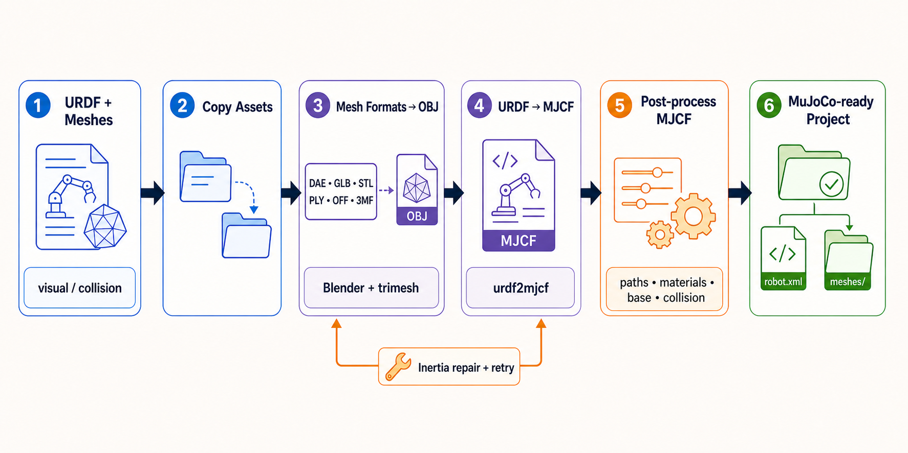

# URDF2MJCF Toolkit

[English](README.md) | [简体中文](README.zh-CN.md)

URDF2MJCF Toolkit 是一套自动化 Python 工具链，用于将机器人 URDF 模型及其网格资源转换为可供 MuJoCo 使用的 MJCF 项目。



## 功能特性

- 通过一条流水线命令将 URDF 转换为 MJCF。
- 复制并规范化视觉资源，可按需处理碰撞资源。
- 将 DAE、GLB、STL、PLY、OFF 和 3MF 网格转换为 MuJoCo 友好的 OBJ。
- 使用 `obj2mjcf` 为 OBJ 资源生成 MJCF 片段。
- 首次转换失败时，可根据网格几何自动重新计算异常惯量。
- 对最终 MJCF 进行后处理，包括网格路径、纹理、材质、默认 geom 类、地面和平动/固定基座设置。
- 提供 URDF 惯量校验和 MuJoCo 模型可视化辅助工具。

## 环境要求

- Python 3.10+
- DAE 转换需要可从 `PATH` 调用的 Blender
- Python 依赖提供的 `obj2mjcf` 和 `urdf2mjcf` 命令行工具
- 校验或可视化模型时需要 MuJoCo Python 绑定

安装项目及核心依赖：

```bash
python -m pip install .
```

按需安装 MuJoCo 可视化和开发工具：

```bash
python -m pip install '.[visualization]'
python -m pip install '.[dev]'
```

在 Ubuntu 上安装 Blender：

```bash
sudo apt install blender
blender --version
```

## 快速开始

使用固定基座转换 URDF：

```bash
python -m urdf2mjcf.urdf_to_mujoco_converter /path/to/robot.urdf
```

指定输出目录并使用浮动基座：

```bash
python -m urdf2mjcf.urdf_to_mujoco_converter robot.urdf ./output --floating-base
```

将碰撞网格导出为独立的 MuJoCo 碰撞 geom：

```bash
python -m urdf2mjcf.urdf_to_mujoco_converter robot.urdf ./output --export-collision
```

开启调试日志：

```bash
python -m urdf2mjcf.urdf_to_mujoco_converter robot.urdf ./output --verbose
```

安装项目后也可使用简短命令：

```bash
urdf2mjcf-toolkit robot.urdf ./output --verbose
```

## 主命令行接口

```bash
python -m urdf2mjcf.urdf_to_mujoco_converter <urdf_path> [output_dir] [options]
```

参数：

- `<urdf_path>`：输入 URDF 文件。
- `[output_dir]`：可选输出目录；省略时会创建与输入目录相邻的 `<input_parent>_mjcf` 目录。

选项：

- `--floating-base`：保留或插入根节点 `<freejoint>`；默认使用固定基座。
- `--export-collision`：复制并处理碰撞资源；模型尚无碰撞几何时添加碰撞 geom。
- `--no-inertia-recalc`：首次 URDF 转换失败时不自动重新计算惯量。
- `-v, --verbose`：输出调试日志。

## 辅助工具

使用 Blender 将 DAE 转换为 OBJ：

```bash
python -m urdf2mjcf.dae_to_obj_converter ./meshes/visual ./converted_visual
```

将 GLB 转换为 OBJ 并提取纹理：

```bash
python -m urdf2mjcf.glb_to_obj_converter ./meshes/visual -o ./converted_visual
```

将 STL、PLY、OFF 或 3MF 转换为 OBJ：

```bash
mesh-to-obj ./meshes --overwrite
```

为 OBJ 资源目录生成 MJCF 片段：

```bash
python -m urdf2mjcf.obj_to_mjcf_converter ./output/meshes/visual --recursive
```

直接更新 URDF 中的惯量：

```bash
python -m urdf2mjcf.urdf_inertia_calculator robot.urdf --geometry visual
```

仅校验 URDF 惯量，不修改文件：

```bash
python kit/urdf_inertia_validator.py robot.urdf
```

校验生成的 MJCF：

```bash
python kit/visualize_mujoco.py output/robot.xml --validate-only
```

打开 MuJoCo 查看器：

```bash
python kit/visualize_mujoco.py output/robot.xml
```

## 转换流程

1. 复制视觉资源，并按需复制碰撞资源。
2. 将 `meshes/visual` 下的 DAE、GLB 及其他受支持网格转换为 OBJ。
3. 暂存 URDF，使 `urdf2mjcf` 转换期间能够正确解析网格路径。
4. 将 URDF 转换为 MJCF；失败时可更新惯量后重试。
5. 对生成的 OBJ 目录运行 `obj2mjcf`。
6. 编辑最终 MJCF，规范化编译器路径、材质、纹理、网格变体、默认 geom 类和基座行为。
7. 将最终 MJCF 和转换后的资源保存到输出目录。

## 输出结构

典型输出目录如下：

```text
output_dir/
  robot.xml
  meshes/
    visual/
      ... 转换后的视觉 OBJ/XML/纹理资源 ...
    collision/
      ... 使用 --export-collision 时生成的碰撞资源 ...
```

## 常见问题

- `Blender executable not found`：安装 Blender 并确认 `blender --version` 可执行，或向 DAE 转换器传入 `--blender-path`。
- `obj2mjcf executable not found`：执行 `python -m pip install .` 重新安装项目，并确认 `obj2mjcf` 在 `PATH` 中。
- 网格或纹理丢失：检查原 URDF 中的网格路径是否指向已有的视觉/碰撞资源目录。
- 惯量无效：运行 `python kit/urdf_inertia_validator.py robot.urdf`，然后在启用自动惯量重算的情况下重试。
- MuJoCo 无法加载模型：运行 `python kit/visualize_mujoco.py output/robot.xml --validate-only` 获取针对性的校验结果。

## 开发

推荐的本地检查：

```bash
python -m compileall urdf2mjcf kit
python -m pytest
ruff check .
black --check .
```

## 参与贡献

欢迎提交 Issue 或 Pull Request。报告问题时请包含清晰的说明、复现步骤，并尽可能提供示例输入模型。

## 许可证

本项目采用 MIT 许可证，详见 [LICENSE](LICENSE)。
